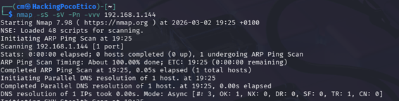
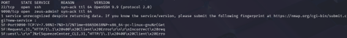
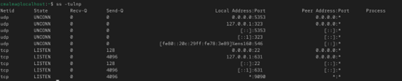
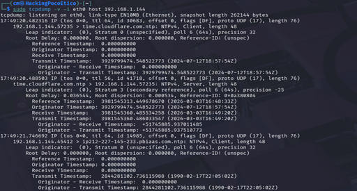
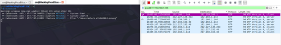

# Reconocimiento inicial

## Escaneo con Nmap

```bash
nmap -sS -sS -Pn -vvv <IP_OBJETIVO>
```
Este comando identifica puertos abiertos en la máquina objetivo.
 Este comando realiza un escaneo avanzado de puertos utilizando Nmap.

Explicación de los parámetros utilizados:

* **-sS** →  SYN scan, permite identificar puertos abiertos de forma eficiente.

* **-sV** → detección de versiones de servicios en los puertos abiertos.

* **-Pn** → evita el descubrimiento de host mediante ping y asume que el host está activo.

* **-vvv** → aumenta el nivel de detalle de la salida del escaneo.

Este tipo de escaneo permite identificar tanto los puertos abiertos como los servicios que se ejecutan en ellos, proporcionando información útil para el análisis del sistema objetivo.

### Resultado del escaneo nmap



## Comprobación local en AlmaLinux

```bash
ss -tulnp
```


Este comando permite visualizar los puertos abiertos y los servicios que están escuchando en el sistema.

ss (socket statistics) es una herramienta de Linux utilizada para mostrar información sobre conexiones de red, sockets y puertos abiertos.

Explicación de los parámetros:

* **-t** → muestra conexiones TCP.

* **-u** → muestra conexiones UDP.

* **-l** → muestra únicamente puertos que están en estado de escucha (listening).

* **-n** → muestra direcciones y puertos en formato numérico, sin resolver nombres DNS.

* **-p** → muestra el proceso y el PID que está utilizando cada puerto.

Este comando es útil para verificar qué servicios están expuestos en el sistema y comprobar si coinciden con los resultados obtenidos durante el escaneo con Nmap.

### Resultado del escaneo de puertos


## Captura de tráfico
``` bash
 tcpdump -i eth0 host 192.168.1.144
```

```tcpdump``` es una herramienta de línea de comandos utilizada para capturar paquetes que circulan por una interfaz de red y analizar el tráfico en tiempo real.

Explicación de los parámetros:

* **-i eth0** → indica la interfaz de red desde la que se capturará el tráfico.

* **host <IP_OBJETIVO>** → filtra los paquetes para mostrar únicamente el tráfico que tiene como origen o destino la dirección IP especificada.

Este comando es útil para analizar la comunicación entre máquinas, verificar conexiones realizadas durante pruebas de red o comprobar el comportamiento de servicios expuestos.

### Resultado de la captura de trafico


## Análisis de tráfico con Wireshark

Wireshark es una herramienta de análisis de red que permite capturar y examinar paquetes que circulan por la red en tiempo real.

Durante el laboratorio se utilizó Wireshark para analizar el tráfico generado durante las pruebas de red, como los escaneos realizados con Nmap y las conexiones entre las máquinas del entorno.

Esta herramienta permite visualizar información detallada de cada paquete, como direcciones IP de origen y destino, protocolos utilizados y contenido de las comunicaciones.

### Resultado de Wireshark
