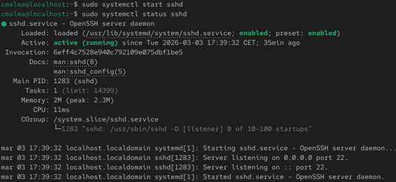
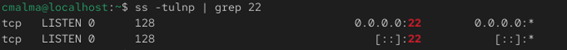
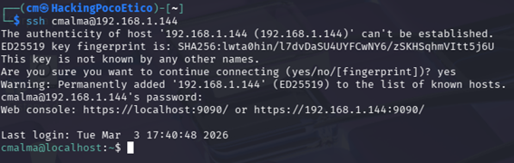

# Configuración de OpenSSH

## Instalación del servidor SSH

```bash
sudo dnf install openssh-server -y
```

## Activación del servicio SSH

```bash
sudo systemctl enable sshd
sudo systemctl start sshd
```

Estos comandos permiten habilitar el servicio SSH para que se inicie automáticamente al arrancar el sistema y ponerlo en funcionamiento.


## Comprobación del estado del servicio

```bash
sudo systemctl status sshd
```

Este comando permite verificar que el servicio SSH está funcionando correctamente.
### Verificacion de la activacion de servicios


## Verificación del puerto SSH

```bash
ss -tulnp | grep :22
```
Este comando permite comprobar que el servicio SSH está escuchando en el puerto 22, que es el puerto por defecto utilizado por este protocolo.

### Resultado


## Conexión SSH desde otra máquina

```bash
ssh usuario@IP_OBJETIVO
```

Este comando permite establecer una conexión remota segura con el servidor desde otra máquina dentro de la red.
### Resultado de la conexion ssh


---

## Conclusión
La configuración de OpenSSH permite habilitar el acceso remoto seguro al sistema.  
Tras instalar y activar el servicio, se verificó que el servidor SSH estaba escuchando en el puerto correspondiente y que era posible establecer una conexión desde otra máquina de la red.

Esta verificación confirma que el servicio funciona correctamente y puede ser utilizado para la administración remota del sistema.