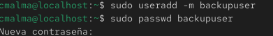
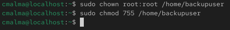
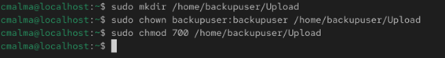
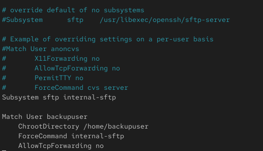
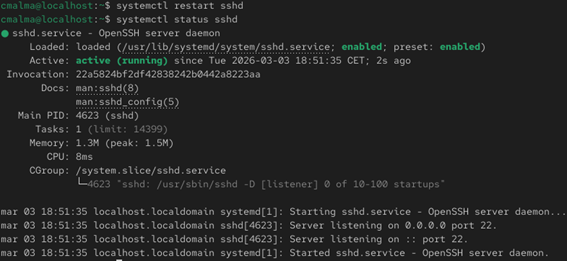
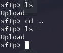
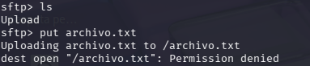

# Configuración de usuario restringido con SFTP

## Creación del usuario de backup

```bash
sudo useradd -m backupuser
sudo passwd backupuser
```
Estos comandos permiten crear un nuevo usuario que será utilizado para realizar transferencias de archivos mediante SFTP.

Explicación de los comandos utilizados:

* **sudo** → ejecuta el comando con privilegios de administrador.

* **useradd** → comando utilizado para crear nuevos usuarios en el sistema.

* **-m** → crea automáticamente el directorio personal del usuario.

* **backupuser** → nombre del usuario que se está creando.

El segundo comando establece la contraseña del usuario para permitir su autenticación en el sistema.

* **passwd** → permite asignar o cambiar la contraseña de un usuario.
  
### Resultado de la creacion


## Configuración del directorio del usuario

```bash
sudo chown root:root /home/backupuser
sudo chmod 755 /home/backupuser
```
Estos comandos configuran los permisos del directorio personal del usuario para cumplir con los requisitos de seguridad necesarios para utilizar chroot.

Explicación de los comandos utilizados:

* **chown** → cambia el propietario de un archivo o directorio.

* **root:root** → establece como propietario y grupo al usuario root.

* **/home/backupuser** → directorio personal del usuario.

El segundo comando modifica los permisos del directorio.

* **chmod** → cambia los permisos de acceso a archivos o directorios.

* **755** → asigna permisos de lectura, escritura y ejecución al propietario, y permisos de lectura y ejecución al resto de usuarios.

Esta configuración es necesaria para que el mecanismo de chroot funcione correctamente en el servidor SSH.
### Resultado de la configuracion


## Creación del directorio para subida de archivos

```bash
sudo mkdir /home/backupuser/Upload
sudo chown backupuser:backupuser /home/backupuser/Upload
sudo chmod 700 /home/backupuser/Upload
```
Se crea un directorio dentro del directorio personal del usuario donde podrá subir archivos mediante SFTP.

Explicación de los comandos utilizados:

* **mkdir** → crea un nuevo directorio en el sistema.

* **/home/backupuser/Upload** → ruta del directorio que se crea para almacenar los archivos subidos.
  
Posteriormente se asigna el propietario del directorio.

* **chown** → cambia el propietario de un archivo o directorio.

* **backupuser:backupuser** → establece al usuario backupuser como propietario del directorio y también como grupo asociado.

Esto permite que el usuario tenga permisos sobre esta carpeta para poder subir archivos mediante SFTP.

Finalmente se asignan los permisos adecuados.

* **chmod** → modifica los permisos de acceso del directorio.

* **700** → concede permisos completos al propietario y niega el acceso a otros usuarios.

De esta forma, el usuario puede almacenar archivos en este directorio sin comprometer la seguridad del sistema.
### Resultado de la creación del directorio de subida


## Configuración de SFTP restringido

Para restringir al usuario únicamente al uso de SFTP se modifica el archivo de configuración de SSH.

```bash
sudo nano /etc/ssh/sshd_config
```
Explicación del comando utilizado:

* **sudo** → ejecuta el comando con privilegios de administrador.
* **nano** → editor de texto utilizado para modificar archivos de configuración desde la terminal.
* **/etc/ssh/sshd_config** → archivo de configuración del servidor SSH.

Se añade la siguiente configuración al final del archivo:
```text
Match User backupuser
ChrootDirectory /home/backupuser
ForceCommand internal-sftp
AllowTcpForwarding no
X11Forwarding no
```
Explicación de las directivas utilizadas:

* **Match User backupuser** → aplica las siguientes reglas únicamente al usuario especificado.
* **ChrootDirectory** → restringe al usuario a un directorio específico del sistema.
* **ForceCommand internal-sftp** → obliga al usuario a utilizar únicamente el protocolo SFTP.
* **AllowTcpForwarding no** → deshabilita el reenvío de conexiones TCP.
* **X11Forwarding no** → deshabilita el reenvío de aplicaciones gráficas.
---
La configuración permite:

* Restringir al usuario al protocolo SFTP

* Limitar el acceso al directorio /home/backupuser

* Evitar el uso de shell interactiva

### Resultado de /etc/ssh/sshd_config


## Reinicio del servicio SSH

```bash
sudo systemctl restart sshd
```
Este comando reinicia el servicio SSH para aplicar los cambios realizados en el archivo de configuración.

Explicación del comando utilizado:

* **systemctl** → herramienta utilizada para gestionar servicios en sistemas Linux basados en systemd.

* **restart** → reinicia el servicio especificado.

* **sshd** → servicio correspondiente al servidor SSH.

### Resultado del reinicio del servicio


## Verificación de la restricción del usuario SFTP

Una vez configurado el acceso restringido, se realizaron pruebas intentando salir del directorio permitido mediante comandos como `cd ..`.

El sistema impide acceder a rutas fuera del directorio configurado mediante **chroot**, confirmando que el usuario queda limitado al directorio asignado.

### Verificacion del chroot



### Permisos en escritorio raiz


---
Toda esta configuración permite que el usuario pueda subir archivos al sistema sin tener acceso a otras partes del sistema operativo, lo que mejora la seguridad del entorno.