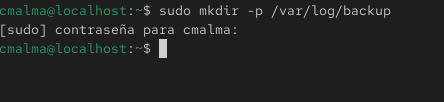
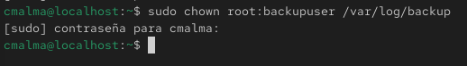
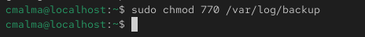
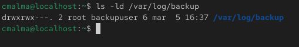
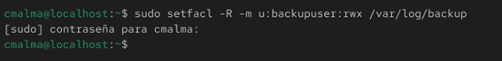
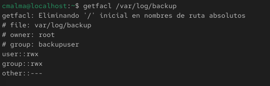

# Gestión de permisos mediante ACL

## Creación del directorio de backup

```bash
sudo mkdir -p /var/log/backup
sudo chown root:backupuser /var/log/backup
sudo chmod 770 /var/log/backup
```
Estos comandos crean un directorio destinado a almacenar copias de seguridad de logs del sistema.

Explicación de los comandos utilizados:

* **mkdir** → crea un nuevo directorio en el sistema.

* **-p** → permite crear la estructura de directorios completa si no existe.

* **/var/log/backup** → ruta donde se almacenarán los archivos de backup.

Posteriormente se asigna el propietario y el grupo del directorio.

* **chown** → cambia el propietario de un archivo o directorio.

* **root:backupuser** → establece al usuario root como propietario y al grupo backupuser como grupo asociado.

Finalmente se configuran los permisos del directorio.

* **chmod** → modifica los permisos de acceso.

* **770** → concede permisos completos al propietario y al grupo, y niega el acceso a otros usuarios.

### Creación del directorio


### Asignar propietario y grupo


### Asignar permisos

### Verificamos



## Visualización de ACL existentes
```bash
getfacl /var/log/backup
```
Este comando permite visualizar las listas de control de acceso (ACL) configuradas en un archivo o directorio.

Explicación del comando:

* **getfacl** → muestra las ACL configuradas en un archivo o directorio.

* **/var/log/backup** → directorio sobre el que se consultan las ACL.

### Visualización de las ACL


## Configuración de ACL por defecto
```bash
sudo setfacl -d -m u:backupuser:rwx /var/log/backup
```

Este comando establece permisos por defecto para que los nuevos archivos creados dentro del directorio hereden automáticamente los permisos definidos.

Explicación de los parámetros utilizados:

Explicación de los parámetros utilizados:

* **setfacl** → comando utilizado para modificar las listas de control de acceso (ACL).

* **-d** → establece ACL por defecto para los archivos y directorios que se creen dentro del directorio especificado.

* **-m** → modifica o añade una nueva regla ACL.

* **u:backupuser:rwx** → concede permisos de lectura, escritura y ejecución al usuario backupuser.

* **/var/log/backup** → directorio al que se aplican las reglas ACL.

### Resultado


## Verificación final de las ACL
```bash
getfacl /var/log/backup
```

El mismo comando que se utilizó anteriormente para visualizar las ACL permite verificar que las reglas se han aplicado correctamente.

### Resultado de verificación


## Conclusión

Mediante ACL es posible conceder permisos específicos a usuarios concretos sin modificar los permisos tradicionales basados en propietario, grupo y otros.