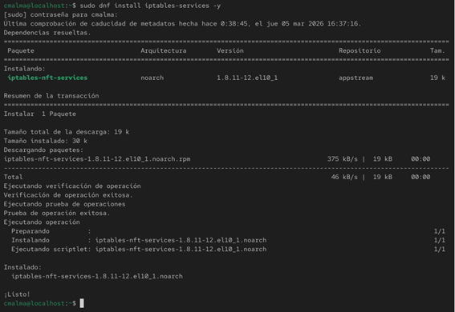
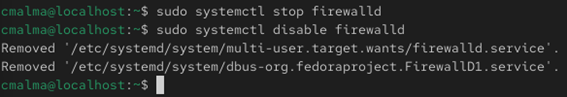
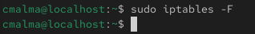
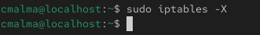
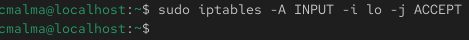
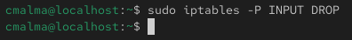
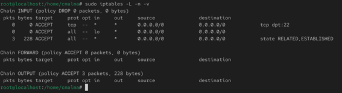
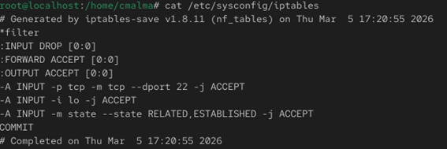

# Configuración de firewall con iptables

## Instalación del servicio iptables

```bash
rpm -q iptables-services
sudo dnf install iptables-services -y
```
Estos comandos permiten comprobar si el servicio iptables-services está instalado en el sistema y, en caso contrario, instalarlo.

Explicación de los comandos utilizados:

* **rpm -q** → consulta si un paquete está instalado en el sistema.

* **iptables-services** → paquete que permite gestionar reglas persistentes de iptables.

* **dnf install** → instala paquetes desde los repositorios del sistema.

* **-y** → confirma automáticamente la instalación.

### Resultado

## Desactivación de firewalld

```bash
sudo systemctl stop firewalld
sudo systemctl disable firewalld
```
Estos comandos detienen y deshabilitan el servicio firewalld para evitar conflictos con iptables.

Explicación de los comandos utilizados:

* **systemctl** → herramienta utilizada para gestionar servicios en sistemas Linux basados en systemd.

* **stop** → detiene el servicio especificado.

* **disable** → evita que el servicio se inicie automáticamente al arrancar el sistema.

* **firewalld** → firewall dinámico que se utiliza por defecto en muchas distribuciones Linux.

### Resultado


## Limpieza de reglas existentes

```bash
sudo iptables -F
sudo iptables -X
```
Estos comandos eliminan las reglas existentes del firewall para comenzar la configuración desde un estado limpio.

Explicación de los parámetros utilizados:

* **-F** → elimina todas las reglas de las cadenas existentes.

* **-X** → elimina cadenas personalizadas creadas previamente.

### Resultado de borrar reglas existentes


### Resultado de borrar cadenas personalizadas

## Permitir tráfico esencial

```bash
sudo iptables -A INPUT -i lo -j ACCEPT
```
Estas reglas permiten el tráfico esencial necesario para el funcionamiento del sistema.

Explicación de los parámetros utilizados:

* **-A INPUT** → añade una regla a la cadena que gestiona el tráfico entrante.

* **-i lo** → permite tráfico proveniente de la interfaz de loopback.

* **-j ACCEPT** → permite el tráfico que coincida con la regla.

* **-m state** → utiliza el módulo de seguimiento de conexiones.

* **--state** ESTABLISHED,RELATED → permite conexiones ya establecidas o relacionadas.

* **-p tcp** → especifica el protocolo TCP.

* **--dport 22** → indica el puerto de destino utilizado por el servicio SSH.

### Resultado

## Política de seguridad por defecto
```bash
sudo iptables -P INPUT DROP
```
Este comando establece la política por defecto de la cadena INPUT para descartar todo el tráfico que no coincida con las reglas definidas.

Explicación de los parámetros utilizados:

* **-P** → establece la política por defecto de una cadena.

* **INPUT** → cadena que gestiona el tráfico entrante al sistema.

* **DROP** → descarta los paquetes que no coincidan con ninguna regla.

### Resultado


## Verificación de reglas
```bash
sudo iptables -L -n -v
```
Este comando permite visualizar las reglas configuradas en el firewall junto con información detallada sobre los paquetes procesados.

Explicación de los parámetros utilizados:

* **-L** → lista las reglas configuradas.

* **-n** → muestra direcciones IP y puertos en formato numérico.

* **-v** → muestra información adicional sobre las reglas.

### Resultado



### Conclusión

La configuración de iptables permite controlar el tráfico de red que entra al sistema mediante reglas de firewall.

Mediante la definición de políticas restrictivas y la apertura únicamente de los puertos necesarios, se mejora la seguridad del servidor frente a accesos no autorizados.

#### Almacenamiento de las reglas
Las reglas implementadas se guardan en el directorio:
/etc/sysconfig/iptables

```bash
cat /etc/sysconfig/iptables
```
