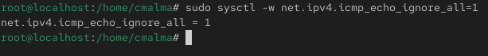
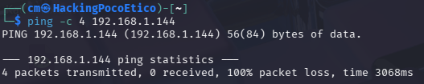

# Mitigación de ICMP (ping)

## Bloqueo de ICMP mediante iptables

```bash
sudo iptables -A INPUT -p icmp -j DROP
```
Este comando añade una regla al firewall para bloquear las peticiones ICMP que llegan al servidor.

Explicación de los parámetros utilizados:

iptables → herramienta utilizada para gestionar reglas de firewall en sistemas Linux.

* **-A** → añade una nueva regla al firewall.

* **INPUT** → cadena que controla el tráfico entrante al sistema.

* **-p icmp** → indica que la regla se aplica al protocolo ICMP.

* **-j DROP** → descarta los paquetes que coincidan con la regla.

### Resultado


## Mitigación de ICMP mediante configuración del kernel
```bash
sudo sysctl -w net.ipv4.icmp_echo_ignore_all=1
```
Este comando modifica un parámetro del kernel para que el sistema ignore las peticiones de tipo ping.

Explicación de los parámetros utilizados:

* **sysctl** → herramienta utilizada para consultar o modificar parámetros del kernel en tiempo real.

* **-w** → permite modificar el valor de un parámetro.

* **net.ipv4.icmp_echo_ignore_all** → parámetro que controla si el sistema responde a peticiones ICMP.

* **1** → indica que el sistema debe ignorar todas las peticiones de ping.

### Resultado

## Verificación del bloqueo de ping
```bash
ping -c 4 IP_OBJETIVO
```
Explicación de los parámetros utilizados:

ping → herramienta utilizada para comprobar la conectividad entre dos equipos.

* **-c 4** → envía cuatro paquetes ICMP.

* **IP_OBJETIVO** → dirección IP del servidor AlmaLinux.

### Resultado



## Hacer persistente la mitigación de ICMP

Para que la configuración que ignora las peticiones de ping se mantenga después de reiniciar el sistema, es necesario añadir el parámetro correspondiente en el archivo de configuración del kernel.

```bash
sudo nano /etc/sysctl.conf
```

Explicación del comando utilizado:

* **nano** → editor de texto utilizado para modificar archivos de configuración desde la terminal.

* **/etc/sysctl.conf** → archivo donde se definen parámetros del kernel que se aplican al iniciar el sistema.

Dentro del archivo se añade la siguiente línea al final:
```bash
net.ipv4.icmp_echo_ignore_all = 1
```

Este parámetro indica que el sistema debe ignorar todas las peticiones ICMP de tipo echo request (ping).

Una vez guardado el archivo, se aplican los cambios con el siguiente comando:
```bash
sudo sysctl -p
```

## Conclusión

El bloqueo de ICMP permite evitar que el servidor responda a peticiones de ping desde otros equipos de la red.

Esta técnica puede utilizarse como medida adicional de seguridad para reducir la visibilidad del sistema frente a posibles escaneos o intentos de reconocimiento de red